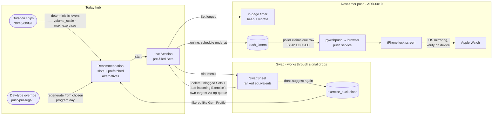
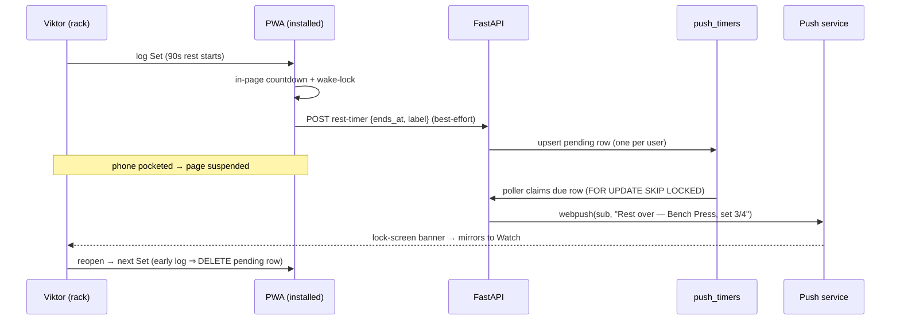

# Fitbod exit: gym-ready PWA (grilled with Viktor, 2026-07-13)

Status: **approved — executing**

Goal: Viktor trains in his gym entirely from this app and deletes Fitbod. The grill
established that the platform is much further along than the ask implied — the app already
**is** an installable offline-first PWA, the rest timer exists, and the "smart workout
picker" exists as the Recommendation engine (Today hub → Program/freestyle → live Session).
What's missing is the last mile of *in-gym* affordances plus real-data seeding.

Decisions of record: ADR-0010 (Web Push rest timer). Vocabulary added to `CONTEXT.md`:
**Swap**, **Exclusion**. Prior art this builds on: ADR-0002 (deterministic engine),
ADR-0004 (Programs from Principles), ADR-0005 (offline-first logging), ADR-0007 (PWA-only).

## Facts the plan is built on (verified in-repo 2026-07-13)

- PWA shell: manifest + icons + `generateSW` precache + offline nav fallback; installed on
  Viktor's iPhone already (screenshots). Offline logging: IndexedDB op-queue + sync engine.
- Rest timer: pure reducer + `RestTimer.svelte`; auto-start on Set log, per-Exercise
  defaults, ±adjust/skip, WebAudio beep + vibrate — **foreground-only cues**.
- Recommendation engine: Program (quiz/presets, autoregulated by Readiness/Recovery,
  receipts) + freestyle; conversational adjust; `instantiate_session` pre-fills the live
  Session's Sets. No per-slot swap; no push infra anywhere in the backend.
- Gym connectivity (Viktor): **usually fine, occasional drops** — online-first with
  offline-tolerant fallbacks is the right posture; ADR-0005's dead-zone machinery stays
  as the safety net.
- Apple Watch: watchOS cannot install a PWA. The only reachable watch surface is the
  iPhone lock-screen notification mirrored by the OS (ADR-0010).

## Grill decisions (Viktor, 2026-07-13)

1. **Picker gap** = per-exercise **Swap** (+ the whole flow is not yet gym-tested) — the
   engine's picks themselves are not the complaint.
2. **Swap UX**: ranked-equivalents bottom sheet (~5–8), ranked by same-primary-muscle
   overlap → Gym Profile fit → Recovery → prefer-has-history; **prefetched with the
   Recommendation** so it opens instantly and survives a signal drop; available on the
   Today preview and mid-Session; the incoming Exercise carries **its own Progression
   targets**.
3. **Swap memory**: **explicit Exclusion only** ("don't recommend this again" on the
   sheet; managed in settings). No implicit down-weighting — ADR-0002 receipts stay honest.
4. **Rest-timer push**: build now (ADR-0010). One feature covers pocket, lock screen, and
   Watch (via OS mirroring, verified on-device).
5. **Fitbod parity extras**: one-tap **duration shaper** ("I have 30/45/60 min") and
   **day-type override** ("give me push day today"). Warmup-ramp-in-plan explicitly NOT
   wanted — the existing warmup calculator suffices.
6. **Go-live seeding**: import Viktor's real Fitbod CSV history, then quiz → activate a
   Program. (On-device install/audio/wake-lock checks: Viktor self-serves; the push
   lock-screen + Watch check is inherently his 5 minutes.)
7. **Sequencing**: all four in one milestone — swap → push → shaper → override — landing
   and deploying each as it finishes. **Done = ~3 consecutive real gym Sessions logged
   entirely in the app, then Fitbod is deleted.**

## Shape

## Work items

### ① Swap + Exclusion (largest; first)

- **Backend** — each Recommendation slot gains `alternatives[]`: top ~8 equivalents with
  their **full prescription** (sets × reps × weight from that Exercise's own Progression),
  computed at generation time by the freestyle selector's ranking (muscle overlap →
  equipment → Recovery → has-history), filtered by Gym Profile + Exclusions. Pure ranking
  core, unit-tested. New table `exercise_exclusions (user_id, exercise_id)` UNIQUE-keyed +
  migration; endpoints to list/add/remove under `/api/exercises`; every generator path
  (Program day, freestyle, adjust, alternatives themselves) filters Exclusions exactly
  like Gym Profile.
- **Frontend** — `SwapSheet.svelte` from the slot ⋮ menu (Today preview + live Session).
  Mid-Session a swap = delete that Exercise's **unlogged** pre-filled Sets + add the
  incoming ones — expressed in existing op-queue verbs, so it works offline on the
  prefetched data. "Don't suggest this again" action (online, best-effort with a clear
  toast); settings section to review/undo Exclusions.

### ② Rest-timer Web Push (ADR-0010)

- **Backend** — `push_subscriptions` + `push_timers` tables (+ migration); subscribe/
  unsubscribe endpoints; schedule/cancel endpoints keyed one-pending-per-user; asyncio
  poller claiming due rows with `SKIP LOCKED` (replica/restart safe); `pywebpush` + VAPID
  keys from Vault (fail-closed 503 like `CONNECTION_ENCRYPTION_KEY`; verify pywebpush API
  via context7 at build time).
- **Frontend** — settings "Timer notifications" toggle (permission prompt from that tap;
  iOS requires the installed PWA); Set-log path best-effort schedules, skip/adjust/early
  next Set cancels/reschedules; `push-sw.js` (push + notificationclick → focus
  `/sessions/{id}`) rides into the existing `generateSW` worker via `importScripts`.
- **Acceptance (Viktor, on-device)** — one real timer push on the lock screen; check it
  buzzes the Watch. Mirroring is OS behavior we don't control — worst case is lock-screen
  only, which already beats today.

### ③ Duration shaper

One-tap chips on Today (30 / 45 / 60 / full). Pure `shape_to_duration(recommendation,
minutes)`: estimate day length from Σ sets × (work + rest), then trim through the
**existing** adjust levers (`volume_scale`, `max_exercises` — accessories first, floors
respected via `validate_adjustment`, deloads never raised). No new engine authority — a
deterministic preset over the adjust path, receipts intact.

### ④ Day-type override

"Train a different day" on Today: sheet listing the active Program's day templates +
freestyle-by-muscle-group; regenerates today's Recommendation from the chosen
`program_day` through the same autoregulation pipeline. The Program pointer self-heals via
the existing `reflow_day_index` — an override never corrupts the schedule.

### ⑤ Go-live seeding (with Viktor)

Fitbod app → export CSV → settings import flow (preview → resolve unmatched → commit) →
PRs/Progression/Recovery seeded from real history → quiz → activate Program → push toggle
on. Then the 3-Session gym trial.

## Execution

Worktree `wizard/fitbod-exit` off `main`; TDD the pure cores (ranking, shaper mapping,
poller claim, exclusion filter — red/green per `superpowers:test-driven-development`);
land + watch CI/deploy per item so each gym visit can pick up whatever's live. Alembic
head moves twice (exclusions; push tables) — coordinate the chain.

## Risks / honesty notes

- **Watch mirroring is the plan's one unverifiable-from-here claim** — flagged as the
  on-device acceptance step, with lock-screen delivery as the accepted worst case.
- iOS quirks batched into ② acceptance: permission only from a user gesture in the
  installed PWA; WebAudio unlock on first touch; wake-lock behavior.
- Offline-logged Sets schedule no push (queue replays later); an offline skip can't cancel
  a scheduled push → rare stray notification. Accepted degradations (ADR-0010).
- A deploy mid-rest could delay a due push by pod-restart seconds — the poller re-claims
  on boot; rest windows are 60–180 s, so the blast radius is one late buzz.
