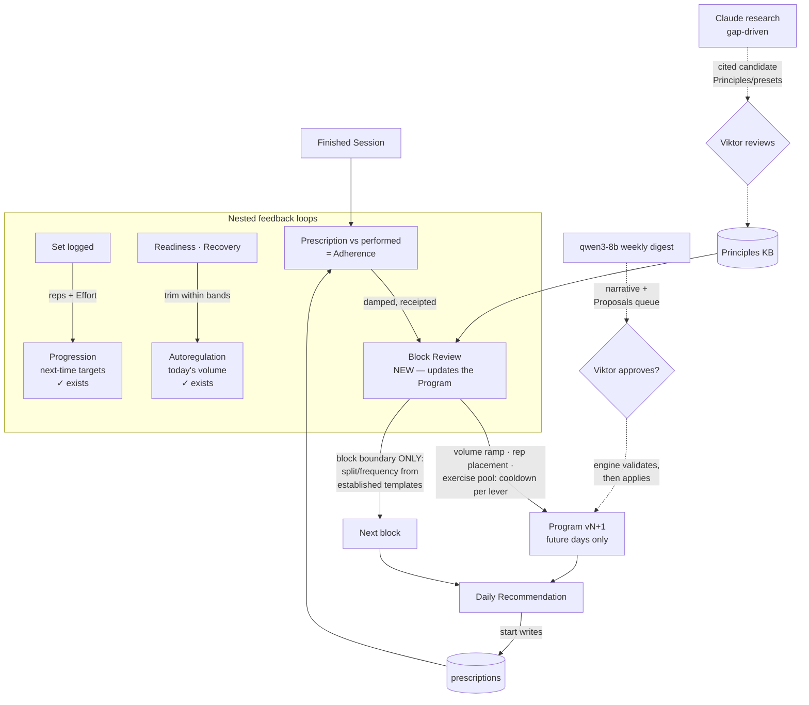
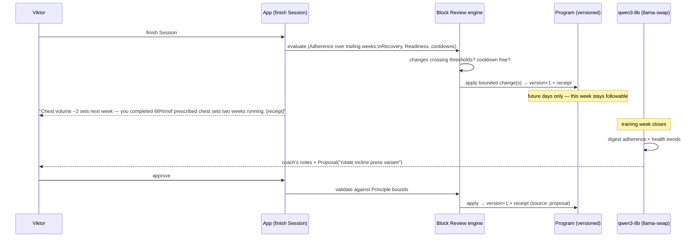

# Adaptive programming: the recursive learning loop (grilled with Viktor, 2026-07-14)

Status: **approved — M4 executing**

Goal: the Program stops being a static artifact. It continuously learns from what Viktor
actually does in the gym (missed sets/reps, Effort) and from his health data, staying an
always-current, followable schedule anchored to established programming — with qwen narrating
and proposing, Claude researching, and the deterministic engine holding all authority.

Decisions of record: **ADR-0011** (continuous damped adaptation; LLM proposes/narrates).
Vocabulary added to `CONTEXT.md`: **Prescription**, **Adherence**, **Block Review**,
**Proposal**. Continues docs/plans/2026-07-13-fitbod-exit-gym-pwa.md as milestones M4–M6 of
the roadmap (M1–M3 shipped).

## Facts the plan stands on (verified 2026-07-14)

- Two learning loops already exist: per-set **Progression** (miss reps at RIR 0 → next-time
  load backs off — Viktor's exact example) and per-day **autoregulation** (Readiness/Recovery
  trims within Principle bands + fatigue early-deload). The Program itself never changes.
- **Adherence is currently unmeasurable**: `instantiate_session` pre-fills Sets the user's
  edits overwrite — no prescribed-state survives a workout. Persisting the Prescription is
  the foundation everything else stacks on.
- In-cluster LLMs are real: `llama-swap` (ns `llama-cpp`) serves `qwen3-8b` (reasoning off)
  behind one OpenAI-compatible `/v1`; `claude-agent-service` is up. The app already owns the
  right seam — the `AdjustProvider` pattern (OpenAI-compatible client, proposes-only,
  engine-validated) generalises to an `AnalysisProvider`.
- Body-comp history exists for the correlation layer (BodyMass 822 / LeanBodyMass 733 /
  BodyFat% 733 samples) but is **stale since 2026-02-07** — the M6 charts only earn their
  keep after the Apple Health catch-up import / Connections land data again.
- Grill decisions: engine auto-applies within bounds, LLM proposes (ADR-0002 upheld); ALL
  levers in scope with structural changes gated to block boundaries + established templates;
  continuous evaluation with damping; qwen scheduled weekly + on demand; research gap-driven
  with curated KB merges; views = Adherence + body-comp-vs-volume (no new tab; strength-vs-
  recovery chart cut).

## The three nested loops

## Milestones

### M4 — Adaptive core (foundation; no LLM dependency) — **building now**

1. **Prescription persistence**: `prescriptions` table (one row per instantiated Session:
   slots JSONB with exercise/sets/reps/weight + source program/freestyle/adjusted/shaped/
   explicit + program id/version/day). Written by every start path. Immutable.
2. **Adherence core** (pure, tested): Prescription + performed Sets (normal-only, the
   `volume.py` rule) → per-slot / per-Session / per-muscle-week metrics: completed-set ratio,
   rep shortfall split by Effort (failed at RIR 0 ≠ stopped with reserve), load deviation,
   missed Sessions.
3. **Program versioning**: `version` on `programs` + `program_revisions` change log (lever,
   target, from→to, evidence, Principle bound, trigger) — the receipt store.
4. **Block Review engine** (pure, tested): damped rule set —
   - volume: muscle ≥2 consecutive weeks under ~80% completion → next week's target −1..2
     sets (never below the Principle floor); ≥95% completion with reserve and healthy
     Readiness → +1 set (never above the ceiling); one move per muscle per training week;
   - rep placement: chronic failure at the range top with reserve absent → sit lower in the
     goal's range (and vice versa), once per block per slot;
   - exercise rotation: a slot failed/stalled 3 consecutive Sessions → rotate via the
     existing Swap ranking (Exclusion-aware), once per slot per week;
   - structural (block boundary only): whole-block day-completion pattern → switch to the
     established template that fits observed capacity (e.g. chronic 2-missed-days on PPL@6 →
     Upper/Lower@4); regenerate next block through the existing generator (numbers still
     from Principles), carrying achieved volume as the new ramp start.
5. **Glue + surfaces**: evaluate on Session finish + on Today load (idempotent, cooldown-
   gated — no scheduler needed yet); revisions/receipts list on the Program page; the
   Adherence week strip (prescribed vs performed per muscle) on Progress; a one-line "what
   changed and why" banner on Today when a change landed.

Exit: after a real training week, the coming week's targets have moved (or provably didn't
need to), every change readable with its receipt.

### M5 — LLM analysis layer (qwen)

1. `AnalysisProvider` (the `AdjustProvider` pattern) → llama-swap `/v1/chat/completions`,
   `model=qwen3-8b`; input = the week's Adherence/outcome/health digest (computed
   deterministically — the LLM never touches raw tables); output = narrative + structured
   Proposals (JSON schema, parsed defensively).
2. `proposals` table + approve/reject endpoints; approved → `validate` against Principle
   bounds → apply as a receipted revision (source: proposal). Rejected → recorded (feeds
   later analysis).
3. Trigger: when a training week closes (in-app scheduler, the push-poller pattern) + an
   on-demand "analyze now". Coach's notes + pending Proposals render on the Programs page.
4. Failure posture: LLM down/garbage JSON → numbers still adapt; prose pauses; never blocks.

Exit: a weekly coach's note appears; one approved Proposal changes the Program with a receipt.

### M6 — Insight views + research pipeline

1. **Adherence view**: weekly prescribed-vs-performed per muscle (completion %, misses,
   RIR-0 failures) — the loop's raw signal made visible (builds on M4's strip).
2. **Body-comp vs volume**: lean mass / body-fat % / weight trend overlaid on per-muscle
   weekly volume. Honesty: whole-body proxies only — no consumer device measures per-muscle
   growth. Needs the Apple Health catch-up import to be current.
3. **Research pipeline**: engine flags "no Principle covers X" gaps; on demand (or per gap)
   a deep-research run drafts candidate Principles/presets with citations; they merge into
   the KB only after Viktor's review (ADR-0004 verification preserved).

Exit: both charts live on refreshed data; at least one researched, human-reviewed Principle
merged and steering generation.

## Risks / honesty notes

- **Oscillation** is the design's main enemy — the damping rules (thresholds, cooldowns,
  future-days-only) are load-bearing and get their own property-style tests (same inputs →
  same single change; alternating good/bad weeks → no flip-flop).
- **Cold start**: the loop needs ~2 weeks of real Prescriptions before it may move anything —
  it ships inert and wakes up as Viktor trains (correct behaviour, stated in-app).
- **LLM JSON reliability** (qwen3-8b): schema-validated parsing, reject-don't-guess, and the
  engine re-validates every Proposal anyway — a hallucination can cost a tap, never a bound.
- **Stale health data**: correlation charts degrade to "no recent data" honestly until the
  catch-up import; Adherence needs nothing but training.
