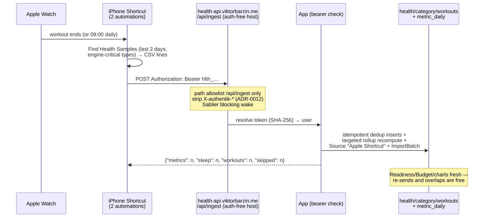

# Apple Health auto-sync — the push Connector (M7, decided with Viktor 2026-07-14)

Status: **executing — shipped same day; awaiting Viktor's one-time iPhone setup**

Goal: after ONE manual export.zip bootstrap, health data imports itself — after every
workout and every morning — with no taps, no paid apps, forever. This builds ADR-0006's
push-receiver Connector kind for Apple Health, the only automatic path Apple allows
(no cloud API exists to pull from).

Decisions of record: **ADR-0012** (public bearer-ingest host). Grill decisions (Viktor):
**engine-critical scope** (HRV, resting HR, sleep intervals, body mass/fat/lean, active
energy, workouts — per-minute HR/step series stay on occasional export.zip) and
**workout-end + morning triggers**.

## Verified facts the design stands on

- iOS Shortcuts has an **Apple Watch Workout trigger** (start/end) that can run
  **without confirmation**, and **Find Health Samples** filters by type + trailing date
  window — the whole pipeline is free, no Apple Developer account, no third-party app.
- HealthKit reads can fail while the phone is locked → every run is best-effort and the
  server is idempotent, so two triggers/day converge (the roadmap's original caveat,
  now load-bearing design).
- The app already owns the landing path: NormalizedRecord-shaped bulk inserts with
  natural-key dedup, targeted rollup recompute (ADR-0009), DataSource + ImportBatch audit
  — the Connector sync's exact pattern, reused verbatim.
- Known gap (out of scope tonight): Workout↔Session auto-linking by time overlap is
  described in CONTEXT.md but not yet implemented — pushed Workouts land unlinked.

## Shape

## What shipped

1. **`ingest_tokens`** (migration `e1f2a3b4c9d0`): per-user revocable credentials,
   SHA-256 at rest, plaintext shown once, `last_used_at` = liveness.
2. **`POST /api/ingest/apple`** (bearer-only — never the forward-auth identity): accepts
   the Shortcut's CSV lines AND JSON; normalises type spellings (display names + HK
   identifiers), lb→kg, sleep stages onto the HK `Asleep*` labels Readiness matches,
   kcal→kJ for workouts; junk lines skipped and counted, never guessed. Pure parser
   (`services/ingest.py`) + landing glue (`services/ingest_query.py`).
3. **Token CRUD** under the normal identity + a Settings section ("Apple Health
   auto-sync"): mint/copy-once/revoke, last-sync freshness, and the full two-automation
   Shortcut recipe.
4. **Infra**: `health-api.viktorbarzin.me` — auth=none, `/api/ingest` path allowlist,
   `strip-auth-headers`, Sablier blocking (ADR-0012).
5. Bootstrap: the existing export.zip upload (unchanged) carries the historical backlog
   once; the Shortcut keeps it current from then on.

## Viktor's one-time setup (~10 min, guided in Settings)

1. Do the catch-up **export.zip import** (Feb → today backlog).
2. Settings → Apple Health auto-sync → **Turn on auto-sync** → copy the token.
3. Build the **Health Sync** shortcut (recipe on screen: Find Health Samples × 6 types →
   CSV lines → POST with the token) and run it once — "Last sync" turns green.
4. Add the two automations: **Apple Watch Workout → Ends → Run Immediately** and
   **Time of Day 09:00 → Run Immediately**, both running Health Sync.

From then on: gym data + overnight HRV/sleep/weight land by themselves; Readiness, the
Budget, the body-comp chart and the Block Review's health inputs stay current with zero
manual imports.
